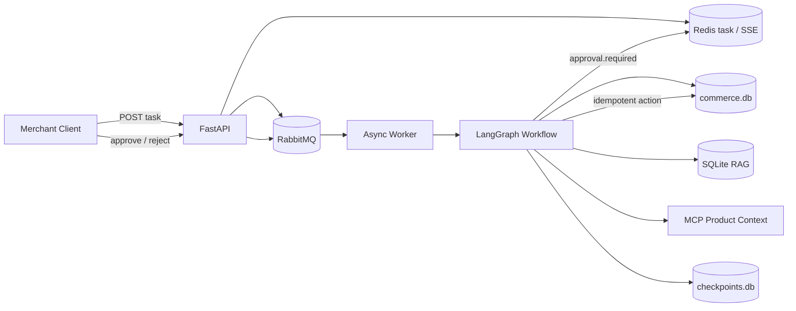

# E-commerce Diagnosis Agent

一个面向商品销量下降场景的后端型电商经营诊断 Agent。商家提交经营问题后，任务异步进入 RabbitMQ；LangGraph 固定业务流程先用 Python 计算漏斗变化，再让模型在只读工具范围内查询商品上下文和经营知识，生成结构化诊断。涉及商品详情修改时，任务暂停等待商家批准，批准后由独立执行节点完成带版本校验的幂等写入。

## 架构



核心流程：

```text
确定商家和商品
→ 计算两周漏斗及流量/转化贡献
→ Agent 有限调用商品上下文与知识工具
→ submit_diagnosis 提交结构化诊断
→ Python 校验，最多一次 Reflection
→ 无写动作则结束
→ 有详情修改则暂停等待批准
→ 校验计划版本和业务幂等键
→ 修改模拟商品详情并返回回执
```

## 已实现能力

- FastAPI 薄路由、RabbitMQ durable queue、手动 ACK、有限重试和死信队列。
- LangGraph 固定外层流程与有限读工具循环。
- `AsyncSqliteSaver` 按任务保存图状态，支持商品选择与审批中断恢复。
- 独立 Streamable HTTP MCP Server，提供模拟商品详情、库存、价格、评论和竞品上下文。
- SQLite RAG，内置指标口径和商品内容优化规则。
- 模拟 `commerce.db`：两个商品、两周漏斗、渠道、库存、价格、评论、计划、审批和动作回执。
- Python 确定性漏斗计算：内置数据中的订单 `200 → 112`，流量贡献 `-34`、转化贡献 `-54`。
- 模型只见读工具；写操作由服务端审批执行器完成。
- SQLite `BEGIN IMMEDIATE`、商品版本和业务唯一键保证重复动作不重复生效。
- Redis 会话、任务状态、消费租约和 SSE 事件流；`Last-Event-ID` 支持事件回放。
- `trace_id` 串联 API、队列、Worker、图节点、模型和工具，记录版本、token、重试和执行回执。
- 六类合成评测案例与轻量 Runner。

## 数据边界

项目只包含合成数据和自写经营规则，不连接真实店铺，也不包含任何内部业务接口、经营数据或文档内容。API 使用环境变量中的静态 Bearer Token 映射固定模拟商家，用于实现服务端身份边界，不等同于生产 OAuth 或统一身份系统。离线评测用于验证行为、可靠性和安全边界，不能证明真实销量提升。

## 启动

1. 复制 `.env.example` 为 `.env`，设置 RabbitMQ 密码和 `DEMO_API_TOKEN`。
2. 使用 Docker Compose 启动服务。
3. API 默认监听 `8080`，RabbitMQ 管理台默认监听 `15672`。

默认 `LLM_PROVIDER=mock`，可运行完整的商品上下文、RAG、诊断、批准和写入链路。启用兼容 Chat Completions 的真实模型时，设置 `LLM_PROVIDER=openai_compatible`、`LLM_API_KEY` 和 `LLM_MODEL`。

## 调用流程

创建任务：

```bash
curl -X POST http://localhost:8080/api/v1/tasks \
  -H 'Content-Type: application/json' \
  -H 'Authorization: Bearer <DEMO_API_TOKEN>' \
  -H 'Idempotency-Key: sales-drop-demo-001' \
  -d '{"prompt":"最近这个商品销量下降了，帮我分析并给优化建议。","product_id":"wireless-headphones"}'
```

订阅 SSE：

```bash
curl -N http://localhost:8080/api/v1/tasks/<TASK_ID>/events \
  -H 'Authorization: Bearer <DEMO_API_TOKEN>'
```

任务进入 `awaiting_approval` 后，从 `interaction` 读取计划字段并批准：

```bash
curl -X POST http://localhost:8080/api/v1/tasks/<TASK_ID>/approvals \
  -H 'Content-Type: application/json' \
  -H 'Authorization: Bearer <DEMO_API_TOKEN>' \
  -d '{"plan_id":"<PLAN_ID>","plan_version":1,"action_id":"update_description","decision":"approve"}'
```

查询聚合 Trace：

```bash
curl http://localhost:8080/api/v1/tasks/<TASK_ID>/trace \
  -H 'Authorization: Bearer <DEMO_API_TOKEN>'
```

不传 `product_id` 时，任务会进入 `awaiting_input`；使用以下接口选择商品：

```bash
curl -X POST http://localhost:8080/api/v1/tasks/<TASK_ID>/inputs \
  -H 'Content-Type: application/json' \
  -H 'Authorization: Bearer <DEMO_API_TOKEN>' \
  -d '{"product_id":"wireless-headphones"}'
```

## Trace 与埋点

当前实现是应用级 Trace Correlation，不宣称已经部署完整 OpenTelemetry 平台。Trace 事件覆盖：

- 任务排队、开始、重试、等待输入、等待批准、拒绝、完成和失败。
- 图的范围解析、指标计算和诊断校验。
- 模型调用次数、输入/输出 token、Prompt/Skill 版本、循环和 Reflection。
- 工具调用、证据 ID、数据快照和失败类型。
- 审批计划、动作回执、商品版本和幂等命中。

日志不记录凭据、完整 Prompt、评论全文或真实商家数据。

## 离线评测

`evals/cases` 包含：

1. 流量下降和漏斗计算。
2. 转化下降、缺货与评论疑问。
3. 商品信息不足时暂停澄清。
4. 结构化诊断失败后一次 Reflection。
5. 批准后重复执行的幂等性。
6. 商家拒绝后不执行修改。

安装开发依赖后可以执行：

```bash
commerce-eval --cases evals/cases --output evals/reports/latest.json
```

评测使用程序断言检查数值、状态和安全边界；事实支持与建议合理性仍需人工检查。Mock 模型只用于可复现回放，真实模型需要单独跑同一组案例。

## 关键工程取舍

- 数值、身份、权限、审批、版本和幂等由代码控制；模型负责选择读工具、解释证据和形成建议。
- Redis 不是 LangGraph 图状态真相源；图状态放 `checkpoints.db`，业务动作账本放 `commerce.db`。
- SSE 事件用于交互和回放，不是模型逐 token 流。
- 首版限定单机 Compose、一个执行 Worker 和低并发。多机扩展时再评估 PostgreSQL、Outbox、标准 OpenTelemetry 和真实下游幂等协议。
