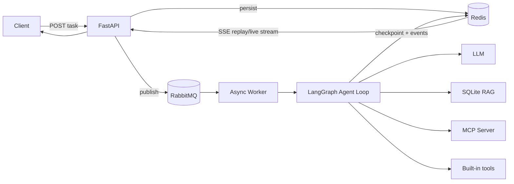

# Backend Agent

一个偏生产后端形态的异步 Agent 服务骨架：请求先落 Redis，再进入 RabbitMQ；Worker 使用 LangGraph 运行 Agent Loop，调用本地 RAG、内置工具和独立 MCP Server；执行事件写入 Redis Stream，并通过 SSE 向客户端回推。



## 已实现能力

- RabbitMQ durable queue、手动 ack、prefetch、固定级别退避队列和死信队列。
- LangGraph 状态图驱动的 model → tools → model 循环。
- 独立 Streamable HTTP MCP Server，默认提供服务健康与故障手册工具。
- SQLite 持久化知识库与稀疏检索，可通过 API 动态写入文档。
- Redis 会话检查点、任务状态、消费租约、幂等映射和 SSE 事件流。
- `Last-Event-ID` 断线续传、任务恢复接口、全局任务超时、I/O 超时、有限重试。
- 最大循环次数与重复工具调用签名检测。
- JSON Trace 日志，贯穿 HTTP、队列、模型和工具调用。
- 默认 `mock` 模型可离线演示完整工具链；切换为 `openai_compatible` 后调用兼容 Chat Completions 的模型服务。

## 启动

1. 复制 `.env.example` 为 `.env`，至少替换 `RABBITMQ_PASSWORD`。若启用真实模型，同时设置 `LLM_PROVIDER=openai_compatible`、`LLM_API_KEY`、`LLM_MODEL`。
2. 启动 Compose 服务。
3. [API](http://localhost:8080) 默认监听 8080 端口，[RabbitMQ 管理台](http://localhost:15672) 默认监听 15672 端口。

## API

创建任务：

```bash
curl -N -X POST http://localhost:8080/api/v1/tasks \
  -H 'Content-Type: application/json' \
  -H 'Idempotency-Key: demo-001' \
  -d '{"prompt":"查询知识库中的 Agent 可靠性建议，并检查 order-service 健康状态"}'
```

订阅事件：

```bash
curl -N http://localhost:8080/api/v1/tasks/<TASK_ID>/events
```

查询任务：

```bash
curl http://localhost:8080/api/v1/tasks/<TASK_ID>
```

失败或中断后续跑：

```bash
curl -X POST http://localhost:8080/api/v1/tasks/<TASK_ID>/resume
```

写入知识库：

```bash
curl -X POST http://localhost:8080/api/v1/knowledge/documents \
  -H 'Content-Type: application/json' \
  -d '{"title":"订单服务手册","content":"order-service 的主要依赖是 MySQL 和库存 RPC。"}'
```

SSE 事件包含 `task.queued`、`task.started`、`agent.model`、`tool.started`、`tool.completed`、`task.retrying`、`task.completed` 与 `task.failed`。客户端重连时可发送 `Last-Event-ID`，服务端会先回放 Redis Stream 中未消费的事件，再继续等待新事件。

## 关键约束

- RabbitMQ 是任务真相源；Redis 不承担主任务队列，仅保存可过期状态与事件。
- 消息语义是 at-least-once。Worker 依赖任务状态和 Redis 租约做幂等保护。
- Redis 数据都有 TTL；生产环境应按业务合规要求调整会话时长和持久化策略。
- 示例 RAG 使用本地稀疏检索，`KnowledgeBase` 接口可以替换为向量数据库实现。
- 示例认证未实现。对公网部署前必须接入统一鉴权、租户隔离、限流和审计。
